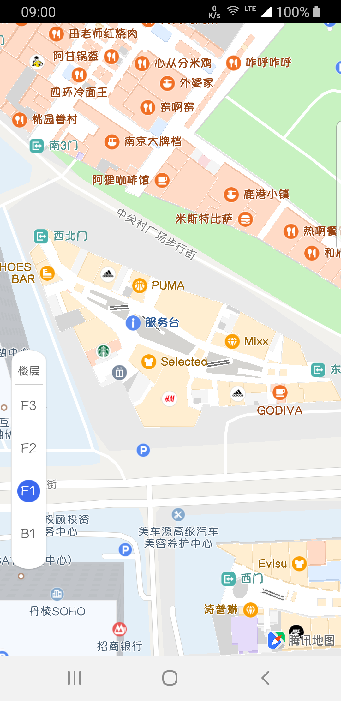
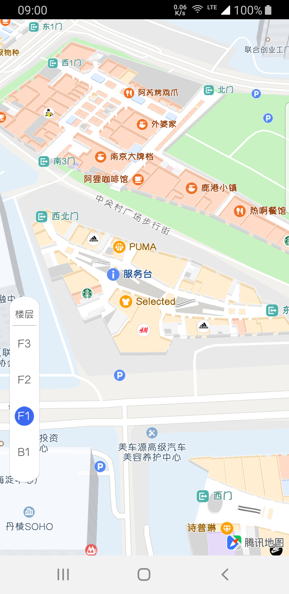

# 室内图

### 介绍

腾讯地图SDK提供室内图展示能力，该能力是高级付费功能，用户可通过[腾讯地图室内官网](https://lbs.qq.com/lbsindoor/home/index.html)详细了解。

下面将分接入展示、操作交互两部分来介绍室内图能力

### 接入展示

接入展示分三步：

1. 申请并配置室内图签权KEY
2. 打开室内图展示开关
3. 查看指定建筑的室内效果

##### 室内图签权KEY

室内图签权KEY和地图KEY是相同的，还没有申请地图KEY，可以到[腾讯地图位置服务中心官网](https://lbs.qq.com/)注册账号，申请地图KEY，目前室内图权限申请没有开通在线申请，如需要请联系[室内图商务](https://lbs.qq.com/contractus.html)协助办理。

已开通室内图权限的KEY，按照AndroidStudio配置中的在AndroidManifest.xml的application标签中配置key完成配置。

##### 室内图展示开关

腾讯地图SDK默认不开启室内图开关，通过以下代码可以已控制室内图启动状态

```java
//开启室内图
mTencentMap.setIndoorEnabled(true);
```

显示3D效果

```java
//开启3D建筑物
mTencentMap.setBuildingEnable(true);
//设置地图俯仰角30度
mTencentMap.moveCamera(CameraUpdateFactory.rotateTo(0, 30));
```


##### 室内展示效果

室内图是私有数据，只能展示签权KEY绑定的建筑物，通过地图SDK的API可以将地图视野移动到指定建筑物，调整地图缩放级别到建筑物室内开放级别内（一般在17～18级）

```java
//移动地图到欧美汇并调整缩放级别到18级
mTencentMap.moveCamera(
  CameraUpdateFactory.newLatLngZoom(new LatLng(39.979381,116.314128),18));
```

以欧美汇为例的效果图如下：






### 操作交互

室内图的操作交互分楼层控件、状态监听回调、数据处理三部分。

##### 楼层控件

腾讯地图SDK提供默认的楼层控件实现，当地图上显示室内图时，楼层控件默认自动显示。楼层控件支持自定义，用户通过注册室内状态回调，获取相关数据来自定义楼层控件。

###### 显示/隐藏开关

```java
//获取UI控件设置
UiSettings uiSettings = mTencentMap.getUiSettings();
//设置隐藏楼层控件
uiSettings.setIndoorLevelPickerEnabled(false);
```

###### 自定义控件

```java
//获取当前激活室内图的楼层名列表
String[] floorNames = mTencentMap.getActivedIndoorFloorNames();
//获取当前激活室内图的楼层ID
int floorId = mTencentMap.getIndoorFloorId();
//初始化室内图的楼层
mTencentMap.setIndoorFloor(建筑物ID,楼层名);
//设置室内图楼层
mTencentMap.setIndoorFloor(楼层ID);
```

##### 状态监听回调

地图SDK支持室内图状态激活的监听OnIndoorStateChangeListener

```java
mTencentMap.setOnIndoorStateChangeListener(new TencentMap.OnIndoorStateChangeListener() {
  @Override
  public boolean onIndoorBuildingFocused() {
    //当室内图在地图展示中心处于激活状态
    return false;
  }

  @Override
  public boolean onIndoorLevelActivated(IndoorBuilding building) {
		//获取在地图展示中心处于激活状态的建筑物
    return false;
  }

  @Override
  public boolean onIndoorBuildingDeactivated() {
    //当室内图在地图展示中心处于非激活状态
    return false;
  }
});
```

##### 处理数据

室内图的数据处理将介绍获取数据和添加室内数据两部分

###### 获取数据

所有相关数据封装在IndoorBuilding模型中

| 属性&方法                      | 说明                 |
| ------------------------------ | -------------------- |
| getBuidlingId()->String        | 获取建筑ID           |
| getBuildingName()->String      | 获取建筑名           |
| getActiveLevelIndex()->Int     | 获取当前楼层索引序号 |
| getLevels()->List<IndoorLevel> | 获取建筑的楼层       |
| getBuildingLatLng()->LatLng    | 获取建筑的坐标       |

在IndoorLevel模型中包含了楼层相关信息

| 属性&方法         | 说明                   |
| ----------------- | ---------------------- |
| getName()->String | 楼层名（B1、F1、F2等） |

###### 添加室内数据

添加在室内的标注、线，只有在该室内图在激活状态下，才可以在地图中展示

1. 创建指定建筑楼层模型

```java
//当前激活楼层序号
int activeLevelIndex = building.getActiveLevelIndex();
//当前激活楼层列表
List<IndoorLevel> levels = building.getLevels();
//当前激活楼层
IndoorLevel activeLevel = levels.get(activeLevelIndex);
//创建室内指定建筑楼层
IndoorInfo indoorInfo = new IndoorInfo(building.getBuidlingId(),activeLevel.getName());
```

2. 添加室内标注

```java
//在指定的建筑楼层中，创建一个标注
mTencentMap.addMarker(new MarkerOptions(new LatLng(39.979303,116.314246))
                      .indoorInfo(indoorInfo));
```

3. 添加室内路线

```java
//在指定的建筑楼层中，创建一条路线
mTencentMap.addPolyline(new PolylineOptions().latLngs(lines).indoorInfo(indoorInfo));
```

---

### 常见问题

1. 室内图不可见

   > 检查地图KEY是否已经授权了室内图能力，并绑定了指定的室内建筑，再调整地图缩放级别到室内图可用级别。