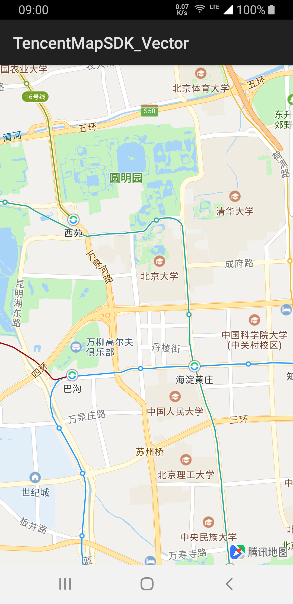

# 显示基础地图

### 介绍

显示基础地图提供创建、获取、销毁相关能力的介绍，适合初级开发者使用。

### 地图创建

创建过程分四步：

1. 准备工程
2. 创建地图视图
3. 自定义地图配置
4. 绑定地图生命周期

按照以下操作步骤，正常运行工程，展示基础地图的效果如图



##### 提前准备

按照[AndroidStudio配置](../guide/config.md)完成之后，在应用工程中的新建一个Activity文件，在onCreate方法创建地图。

##### 创建地图视图

提供三种视图类型，分别是：

1. MapView 普通地图视图
2. TextureMapView 纹理化地图视图
3. MapRenderLayer 地图渲染层容器

##### 不同地图视图类型的差异

| 视图类型       | 内部实现         | 视图动画 | 性能     | ListView显示 | 多实例 |
| :------------- | ---------------- | -------- | -------- | ------------ | ------ |
| MapView        | GLSurfaceView    | 不支持   | 高       | 不流畅       | 支持   |
| TextureMapView | TextureView      | 支持     | 中       | 不流畅       | 支持   |
| MapRenderLayer | Surface+GLThread | 外部控制 | 外部控制 | 流畅         | 支持   |

###### 通过MapView创建地图

```java
MapView mapView = new MapView(context);
parentView.addView(mapView);
```

###### 通过TextureMapView创建地图
```java
TextureMapView mapView = new TextureMapView(context);
parentView.addView(mapView);
```

###### 通过MapRenderLayer创建地图

```java
SurfaceTexture surface = ...;
TencentMapOptions mapOptions = new TencentMapOptions();
mapOptions.setExtSurface(surface);
mapOptions.setExtSurfaceDimension(900, 900);
MapRenderLayer mapView = new MapRenderLayer(context, mapOptions);
parentView.addView(mapView);
```

##### 自定义地图配置

在地图视图创建的时候，可以通过配置TencentMapOptions来自定义地图

| 方法                                         | 说明                         |
| -------------------------------------------- | ---------------------------- |
| setTypeface(Typeface typeface)               | 自定义字体库                 |
| setExtSurface(Object surface)                | 自定义Surface                |
| setExtSurfaceDimension(int width,int height) | 设置自定义Surface大小        |
| setCustomLocalPath(String path)              | 设置资源目录                 |
| setCustomAssetsPath(String path)             | 设置Asset资源目录            |
| setSubInfo(String subKey, String subId)      | 设置扩展KEY                  |
| setHandDrawMapEnable(boolean enable)         | 设置手绘图开关               |
| setMultipleInfoWindowEnable(boolean enable)  | 设置InfoWindow多窗口模式开关 |

##### 绑定地图生命周期

创建地图视图之后，需要跟应用绑定生命周期，以保障地图在应用的不同生命周期中，能够正确地处理显示和刷新逻辑

| 应用生命周期 | 地图生命周期 |
| ------------ | ------------ |
| onStart()    | onStart()    |
| onResume()   | onResume()   |
| onPause()    | onPause()    |
| onStop()     | onStop()     |
| onDestroy()  | onDestroy()  |

##### Fragment包装类

地图提供SupportMapFragment容器包装MapView创建地图，里面内含生命周期的绑定调用

### 获取地图

创建地图视图成功之后，通过视图对象可以直接获取地图实例

```java
MapView mapView = ...;
//获取地图实例
TencentMap mTencentMap = mapView.getMap();
//第一次渲染成功的回调
mTencentMap.setOnMapLoadedCallback(new OnMapLoadedCallback() {
  	public void onMapLoaded() {
       //地图正常显示
    }
});
```

### 销毁地图

地图创建之后，与应用的生命周期绑定，应用触发onDestroy()时，地图也将进行销毁。


---

### 常见问题

1. 地图白屏

   > 常见的白屏原因是地图正常绘制渲染，但内部资源没有被正常加载，请开发者检查一下网络、权限、存储是否正常。
   >
   > 另外，Android 10的适配版本为4.2.8，请同步更新SDK版本。

2. 地图黑屏

   > 黑屏情况主要的可能原因是地图没有正常绘制渲染，请开发者检查一下地图视图有没有正常绑定各个生命周期方法。

3. 初始化出现崩溃

   > 初始化崩溃常见的问题是地图引擎库没有正常配置，或者混淆出现问题导致，请参考[AndroidStudio配置](../guide/config.md)进行完整的配置。
   
4. 地图中间出现“鉴权失败,请检查你的key”

   > 检查是否正确填写KEY，注意TencentMapSDK的<meta>必须放在<application>标签内，同时需要检查此KEY是否绑定了应用的包名。

