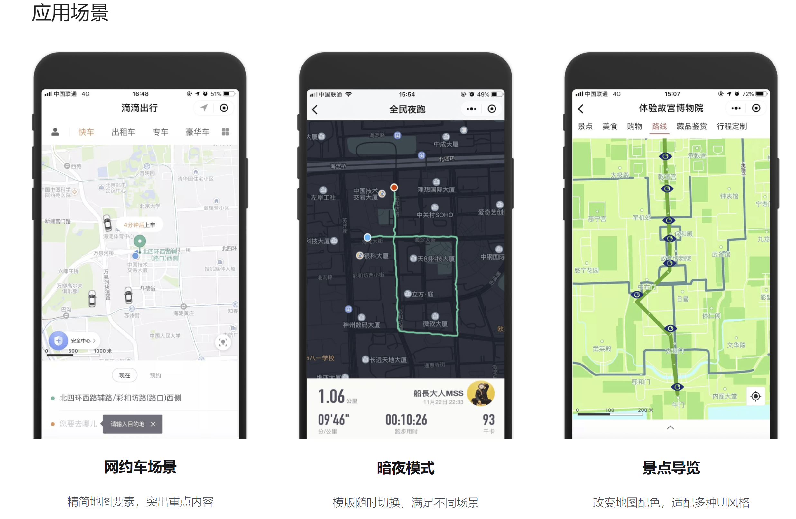
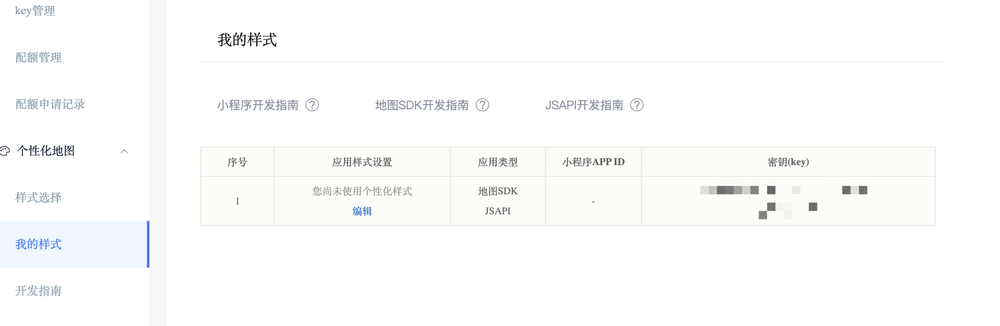
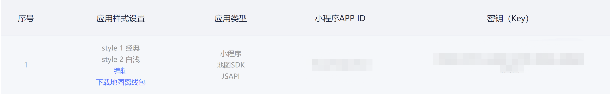

# 个性化地图

### 介绍

腾讯地图SDK从4.1.1版本开始支持个性化配置地图样式，开发者通过[腾讯个性化地图官网](https://lbs.qq.com/console/customized/set/)，创建配置个性化地图。腾讯位置服务为开发者免费提供了4种基础地图样式模版，分别是经典、墨渊、白浅、烟翠，还有2款高级模版供企业客户使用，分别是玉露、澹月。可以满足大部分开发者在不同场景下的个性化需求。



同时为满足开发者们深度个性化需求，腾讯位置服务提供在线编辑平台，支持4大类，44种小类地图元素的样式自定义。对地图上的绿地、水系、公园等背景面、道路网、POI的展示效果进行调整，目前支持透明度、颜色、描边、级别等属性修改。

无论是选用模板还是开发者自定义的个性化地图样式，在SDK使用之前都需要和Key绑定。目前一个Key支持绑定3个个性化样式



如果已经创建好了个性化地图，使用腾讯地图SDK接入分两步：

1. 准备好地图
2. 设置地图样式

### 准备好地图

准备好可展示个性化样式的地图，需要分两步：

1. 可正常展示地图
2. 正确地处理个性化的资源

##### 展示地图

按照之前[创建基础地图](./show-a-map.md)的步骤，完成基本地图的展示

##### 处理资源

腾讯地图SDK提供两种配置个性化资源方式：在线更新、离线资源

###### 在线更新

腾讯地图SDK默认支持动态更新开发者在“我的样式”中修改的个性化样式

###### 离线资源

为了节省下载资源过程的时间，并达到首次加载成功的目的。开发者可以将个性化地图资源直接下载到本地，通过腾讯地图SDK的个性化离线配置接口部署到手机中

如下图所示，提供地图离线包下载入口



相关离线包配置的代码示例如下：

```java
TencentMapOptions mapOptions = new TencentMapOptions();
//将本地资源打包到apk的asset目录中
mapOptions.setCustomAssetsPath("myMapStyle");
//从手机指定目录共享资源
mapOptions.setCustomLocalPath("/sdcard/package_name/local_map_style/");
```

### 设置地图样式

地图样式的设置和之前的[地图类型切换](./change-map-type.md)是相同的接口，其中参数为“我的样式”中配置的style编号。如上图中style1为经典样式，style 2为白浅样式。

```java
//参数1对应的是“我的样式”中的序号
mTencentMap.setMapTyle(1);
```

