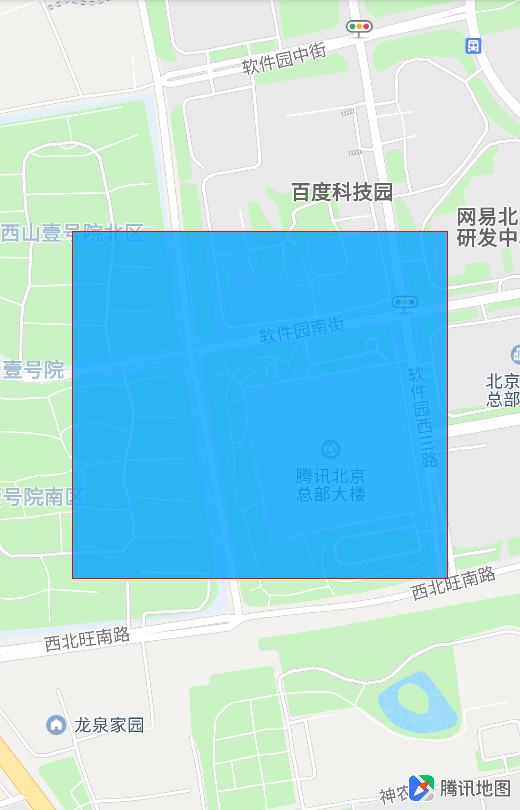

# 限制显示区域

### 简介
腾讯地图 SDK 支持将地图限制在指定的经纬度范围内，即只能在一定区域内缩放、移动地图视野。

### 相关接口

| 方法名 | 说明 |
| :- | :- |
| setRestrictBounds(LatLngBounds restrictBounds, RestrictBoundsFitMode fitMode) | 限制地图的显示范围。此接口同时会限制地图的最小缩放 __整数__ 级别，用户还可以通过 setMinZoomLevel(int) 修改自己需要的最小缩放级别获取需要的展示效果<br>__这个方法只有在 OnMapLoadedCallback 回调后才能正常使用__|

### 使用示例

```java
List<LatLng> latLngs = new ArrayList<>();
latLngs.add(new LatLng(40.042893, 116.269673));
latLngs.add(new LatLng(40.038951, 116.275241));
LatLngBounds bounds = LatLngBounds.builder()
        .include(latLngs)
        .build();
tencentMap.addPolygon(new PolygonOptions()
        .add(bounds.getNorthEast())
        .add(bounds.getNorthWest())
        .add(bounds.getSouthWest())
        .add(bounds.getSouthEast())
        .strokeColor(Color.RED)
        .strokeWidth(2));
tencentMap.setRestrictBounds(
        bounds,
        RestrictBoundsFitMode.FIT_WIDTH);
```

效果如下图所示：
