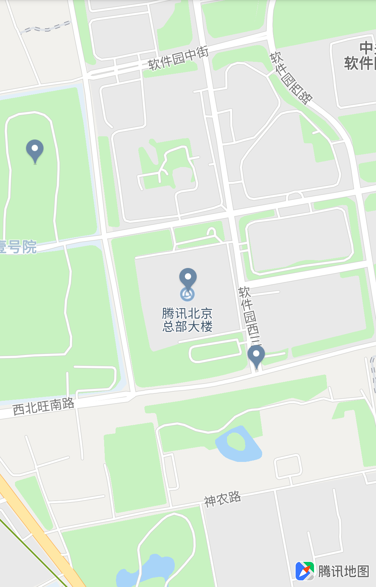
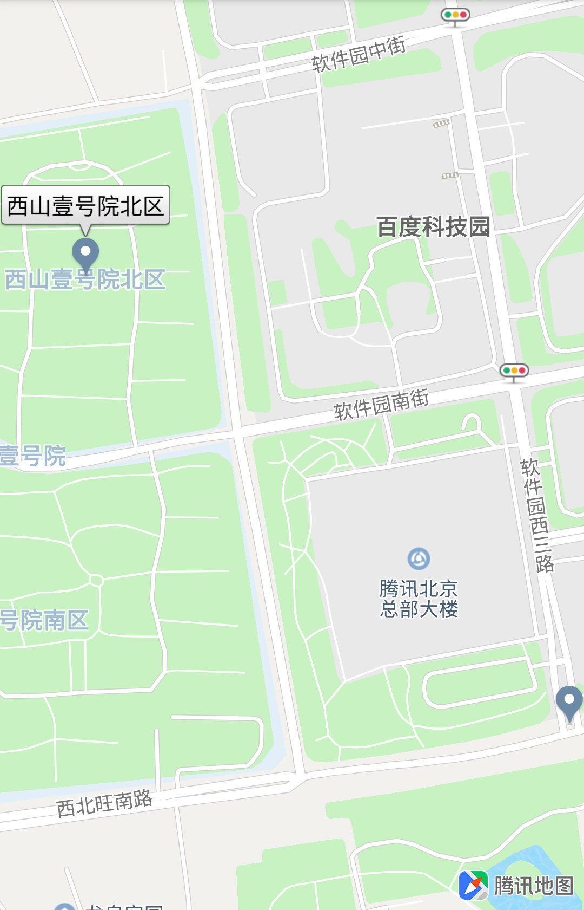

# 视野范围设置

### 简介

允许用户将地图设置到合适的视野并把一系列点、地图覆盖物都在一屏内展示出来

### 构造方式

`CameraUpdateFactory` 提供了一些工厂方法帮助用户快速构造需要的地图视野参数

| 方法名 | 说明 |
| :- | :- |
| newLatLngBounds(LatLngBounds latlngbounds, int padding) | 把地图移到到以指定的经纬度范围的，并且在这个范围四周加上padding像素的填充。 需要注意的是，sdk 内部的计算是在CameraPosition.bearing 和 CameraPosition.tilt 都为 0 时得到的计算结果， 用户如果需要地图完全展示 latlngbounds，也需要将地图的 CameraPosition.bearing 和 CameraPosition.tilt 都置为 0。 |
| newLatLngBoundsRect(LatLngBounds latlngbounds, int leftPadding, int rightPadding, int topPadding, int bottomPadding) | 把地图移动到指定经纬度范围，以适应当前屏幕的显示，并且可以为上下左右分别设置填充的像素 |
| newLatLngBoundsWithMapCenter(LatLngBounds latLngBounds, LatLng mapCenter, int padding) | 以mapCenter为中心，将latLngBounds对应的区域刚好缩放到可视区域内，并且在这个范围四周加上padding像素填充 |

`TencentMap` 提供了一个方法帮助用户计算含有 `Marker`、`Polyline`、`Polygon` 和 `Circle` 元素时的地图视野范围

| 方法名 | 说明 |
| :- | :- |
| calculateZoomToSpanLevel(java.util.List<IOverlay> elements, java.util.List<LatLng> points, int leftPadding, int rightPadding, int topPadding, int bottomPadding) | 计算出要在当前底图可视区域内显示一组元素及一组点的比例尺和中心点（有填边）<br>目前只有在 CameraPosition.bearing == 0 且 CameraPosition.tilt == 0 时才能获取到正确的值<br>__这个方法只有在 OnMapLoadedCallback 回调后才能计算出正确的值__ |

### 使用示例

1、设置经纬度范围的同时设置地图中心点：

```java
List<LatLng> latLngs = new ArrayList<>();
latLngs.add(new LatLng(40.042893, 116.269673));
latLngs.add(new LatLng(40.038951, 116.275241));
LatLng center = new LatLng(40.040429, 116.273525);
tencentMap.addMarker(new MarkerOptions(latLngs.get(0))
        .anchor(0.5f, 1));
tencentMap.addMarker(new MarkerOptions(latLngs.get(1))
        .anchor(0.5f, 1));
tencentMap.addMarker(new MarkerOptions(center)
        .anchor(0.5f, 1));
tencentMap.moveCamera(CameraUpdateFactory.newLatLngBoundsWithMapCenter(
        new LatLngBounds.Builder()
                .include(latLngs)
                .build(),
        center,
        100));
```

效果如下图所示：


2、将所有 `Marker` 展示出来：

```java
List<LatLng> latLngs = new ArrayList<>();
latLngs.add(new LatLng(40.042893, 116.269673));
latLngs.add(new LatLng(40.038951, 116.275241));
Marker marker1 = tencentMap.addMarker(new MarkerOptions(latLngs.get(0))
        .anchor(0.5f, 1)
        .title("西山壹号院北区"));
marker1.showInfoWindow();
Marker marker2 = tencentMap.addMarker(new MarkerOptions(latLngs.get(1))
        .anchor(0.5f, 1));
List<IOverlay> overlays = new ArrayList<>();
overlays.add(marker1);
overlays.add(marker2);
tencentMap.moveCamera(CameraUpdateFactory.newCameraPosition(
        tencentMap.calculateZoomToSpanLevel(
                overlays, null,
                0, 0, 0, 0)));
```

效果如下图所示：
