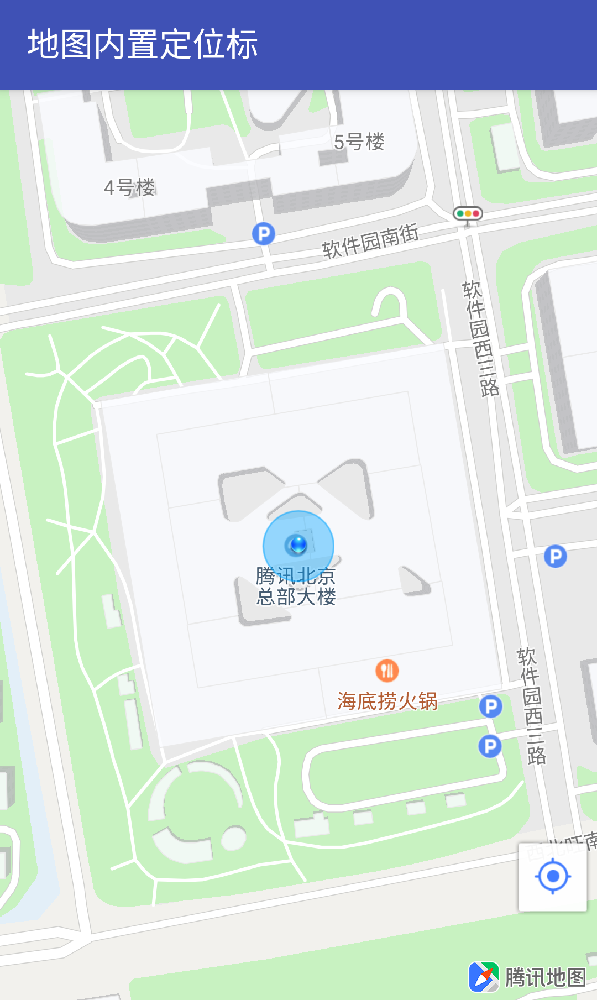

# 定位点

### 简介

地图 SDK 提供了定位点控件，帮助开发者方便地实现地图上的定位点绘制需求。下面是一个定位点的效果图：



<span style="color:red">请注意，地图 SDK 只提供地图的展示效果，定位能力需要接入 [定位SDK](https://lbs.qq.com/geo/index.html)。</span>

### 展示定位点

再打开定位点展示开关前，用户必须配置为地图设置定位源（LocationSource），定位源的作用就是为定位点提供要放置的位置。作为地图 SDK 的一个接口类，用户应实现这个接口，这个类中提供了以下功能：

| 接口 | 功能 |
| -- | :-- |
| activate( LocationSource.OnLocationChangedListener var1) | 当用户开启展示定位点时，SDK 会回调这个方法，并将 SDK 内部的位置监听器返回给用户，用户可以通过这个位置监听器设置定位点的坐标、精度等位置信息 |
| deactivate() | 当用户关闭定位点展示时会回调这个方法，用户应在此时销毁监听位置时申请的所有资源 |

下面我们使用腾讯定位 SDK 作为定位源演示定位点的展示功能。

1. 配置腾讯定位 SDK 

    ```java
    /**
    * 定位的一些初始化设置
    */
    private void initLocation(){
        //用于访问腾讯定位服务的类, 周期性向客户端提供位置更新
        locationManager = TencentLocationManager.getInstance(this);
        //创建定位请求
        locationRequest = TencentLocationRequest.create();
        //设置定位周期（位置监听器回调周期）为3s
        locationRequest.setInterval(3000);
    }

    /**
    * 腾讯定位SDK位置变化回调
    */
    @Override
    public void onLocationChanged(TencentLocation tencentLocation, int i, String s) {
        //其中 locationChangeListener 为 LocationSource.active 返回给用户的位置监听器
        //用户通过这个监听器就可以设置地图的定位点位置
        if(i == TencentLocation.ERROR_OK && locationChangedListener != null){
            Location location = new Location(tencentLocation.getProvider());
            //设置经纬度
            location.setLatitude(tencentLocation.getLatitude());
            location.setLongitude(tencentLocation.getLongitude());
            //设置精度，这个值会被设置为定位点上表示精度的圆形半径
            location.setAccuracy(tencentLocation.getAccuracy());
            //设置定位标的旋转角度，注意 tencentLocation.getBearing() 只有在 gps 时才有可能获取
            location.setBearing((float) tencentLocation.getBearing());
            //将位置信息返回给地图
            locationChangedListener.onLocationChanged(location);
        }
    }
    ```

2. 实现 LocationSource
   
   ```java
    @Override
    public void activate(OnLocationChangedListener onLocationChangedListener) {
        //这里我们将地图返回的位置监听保存为当前 Activity 的成员变量
        locationChangedListener = onLocationChangedListener;
        //开启定位
        int err = locationManager.requestLocationUpdates(
            locationRequest, this, Looper.myLooper());
        switch (err) {
            case 1:
                Toast.makeText(this,
                    "设备缺少使用腾讯定位服务需要的基本条件",
                    Toast.LENGTH_SHORT).show();
                break;
            case 2:
                Toast.makeText(this,
                    "manifest 中配置的 key 不正确", Toast.LENGTH_SHORT).show();
                break;
            case 3:
                Toast.makeText(this,
                    "自动加载libtencentloc.so失败", Toast.LENGTH_SHORT).show();
                break;
            default:
                break;
        }
    }

    @Override
    public void deactivate() {
        //当不需要展示定位点时，需要停止定位并释放相关资源
        locationManager.removeUpdates(this);
        locationManager = null;
        locationRequest = null;
        locationChangedListener=null;
    }
   ```

3. 设置定位源并打开位置显示开关
    ```java
    //地图上设置定位数据源
    tencentMap.setLocationSource(this);
    //设置当前位置可见
    tencentMap.setMyLocationEnabled(true);
    ```

至此就可以展示出地图默认的定位点效果

### 修改定位点样式

通常开发者希望展示自己的定位点样式以满足自己 APP 的整体设计，我们的地图 SDK 通过 `MyLocationStyle` 这个类提供了定制化定位点样式的能力，下面列出了部分定制化能力，更多内容请参考[接口文档](https://lbs.qq.com/AndroidDocs/doc_3d/com/tencent/tencentmap/mapsdk/maps/model/MyLocationStyle.html)

| 接口 | 功能 |
| -- | :-- |
| anchor(float u, float v) | 定位图标的锚点位置，默认为 (0.5f, 0.5f) |
| icon(BitmapDescriptor myLocationIcon) | 定位点的图标 |
| fillColor(int fillColor) | 以圆形表示的定位精度的填充颜色 |
| strokeColor(int strokeColor) | 以圆形表示的定位精度的描边颜色 |
| strokeWidth(int strokeWidth) | 以圆形表示的定位精度的描边宽度 |

### 定位点模式

在地图的各种应用场景中，用户对定位点展示时也希望地图能跟随定位点旋转、移动等多种行为。在腾讯地图 SDK 中开发者可以通过 `MyLocationStyle.myLocationType(int myLocationType)` 接口设置定位点展示时地图的行为模式：

| 模式 | 说明 |
| -- | :-- |
| LOCATION_TYPE_FOLLOW_NO_CENTER | 连续定位，但不会移动到地图中心点，并且会跟随设备移动 |
| LOCATION_TYPE_LOCATION_ROTATE | 连续定位，且将视角移动到地图中心，定位点依照设备方向旋转，并且会跟随设备移动,默认是此种类型 |
| LOCATION_TYPE_LOCATION_ROTATE_NO_CENTER | 连续定位，但不会移动到地图中心点，定位点依照设备方向旋转，并且跟随设备移动 |
| LOCATION_TYPE_MAP_ROTATE_NO_CENTER | 连续定位，但不会移动到地图中心点，地图依照设备方向旋转，并且会跟随设备移动 |