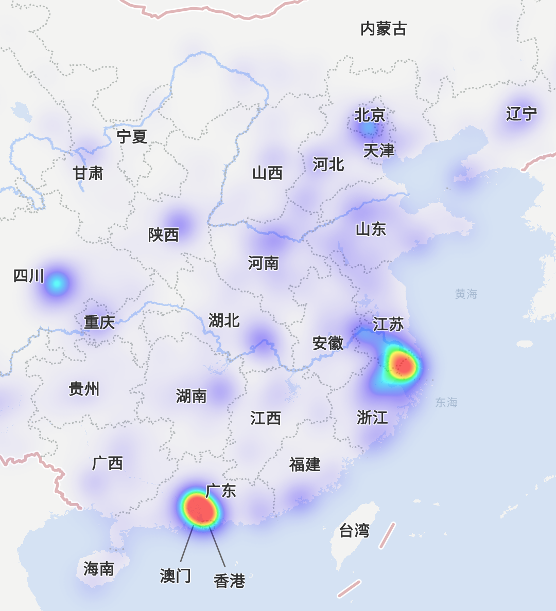

绘制热力图层
========================

### 简介

热力图是一种自定义瓦片层，它能够在地图上表达数据的密度和分布状况。

在4.2.5版本之前，虽然提供了一种热力图实现接口，但并不标准化，4.2.5版本完成了新的标准化热力图接口，
在com.tencent.map.sdk.utilities包名下，而旧的热力图方案，已经迁移到兼容库[^maven]中。

新版本热力图显示效果更细腻、自然，在操作热力图的过程也更加简单，下面是一张截图效果：



图1：热力图示例效果

开发者可以通过自定义热力图的渐变颜色和其他属性，来调整自己需要的样式。下面我们将分三部分，帮助开发者熟悉热力图的配置：

1. 添加一个简单的热力图
2. 自定义热力图样式
3. 移除热力图

### 添加一个简单的热力图

为了添加一个简单的热力图，你需要提前准备好带有坐标分布的数据集，首先，创建一个
[HeatMapTileProvider](../library/src/main/java/com/tencent/map/sdk/utilities/heatmap/HeatMapTileProvider.java)，
然后，将准备好的数据集设置到`HeatMapTileProvider`中，再创建一个[TileOverlayOptions](../library/src/main/java/com/tencent/tencentmap/mapsdk/maps/model/TileOverlayOptions.java)，
将`HeatMapTileProvider`配置到`TileOverlayOptions`中，并添加TileOverlay到地图中即可。

`HeatMapTileProvider`类实现了[TileProvider](../library/src/main/java/com/tencent/tencentmap/mapsdk/maps/model/TileProvider.java)接口，
使它能够为地图提供热力瓦片图，`HeatMapTileProvider`将`LatLng`或者[WeightedLatLng](../library/src/main/java/com/tencent/map/sdk/utilities/heatmap/WeightedLatLng.java)
数据集合，根据默认的半径、渐变色、透明度进行计算，并生成对应缩放级别的瓦片图片。

详细使用方法：

1. 使用`HeatMapTileProvider.Builder()`，将`LatLng`坐标数据，添加到`HeatMapTileProvider`中
2. 创建一个`TileOverlayOptions`对象，设置`HeatMapTileProvider`和其他配置属性
3. 调用`TencentMap.addTileOverlay()`方法，将热力图添加到地图中

```java
private TileOverlay addHeatMap(TencentMap map, List<LatLng> nodes) {
    HeatMapTileProvider provider = new HeatMapTileProvider.Builder().data(nodes).build();
    return map.addTileOverlay(new TileOverlayOptions().tileProvider(provider));
}
```
##### 使用WeightLatLng的数据集

除了`LatLng`之外，我们还提供一种带有权重的坐标类型`WeightLatLng`，能更方便的展示已加工的坐标数据，提高热力图生产效率。

详细使用方法：
1. 将原始数据读出并填充到`WeightLatLng`的数据集中 
2. 使用`HeatMapTileProvider.Builder().weightedData()`替换`HeatMapTileProvider.Builder().data()`方法

### 自定义热力图样式

我们提供一些参数来满足自定义样式的热力效果，您可以通过`HeatMapTileProvider.Builder()`中提供的接口，来重新配置新的热力图层。
为了能够正常显示新的图层，建议清除热力图的缓存，并重新`reload`图层。

可选参数的说明：
1. **Radius**：半径，默认40像素，使用默认的高斯模糊生成的等高曲线，半径越大颜色过渡越平滑，半径越小颜色过渡越锐利
2. **Gradient**：渐变色域，默认颜色容量为1000个颜色值，由多个颜色端进行过渡处理，颜色值按权重大小从小到大排序
3. **Opacity**：图层透明度，默认为0.7，取值范围在(0,1)之间

示例：创建一个新的渐变色域
```java
int[] colors = {
  Color.rgb(102, 225, 0), // 绿色
  Color.rgb(255, 0, 0)    // 红色
};

float[] startPoints = {
  0.2f, 1f
};

Gradient gradient = new Gradient(colors, startPoints);

mProvider = new HeatMapTileProvider.Builder()
  .data(mList)
  .gradient(gradient)
  .build();

mOverlay = mMap.addTileOverlay(new TileOverlayOptions().tileProvider(mProvider));
```
改变图层透明度

```java
mProvider.setOpacity(0.7);
mOverlay.clearTileCache();
mOverlay.reload();
```
### 移除热力图

```java
mOverlay.remove();
```

[^maven]: com.tencent.map:compat-v4:lastest

