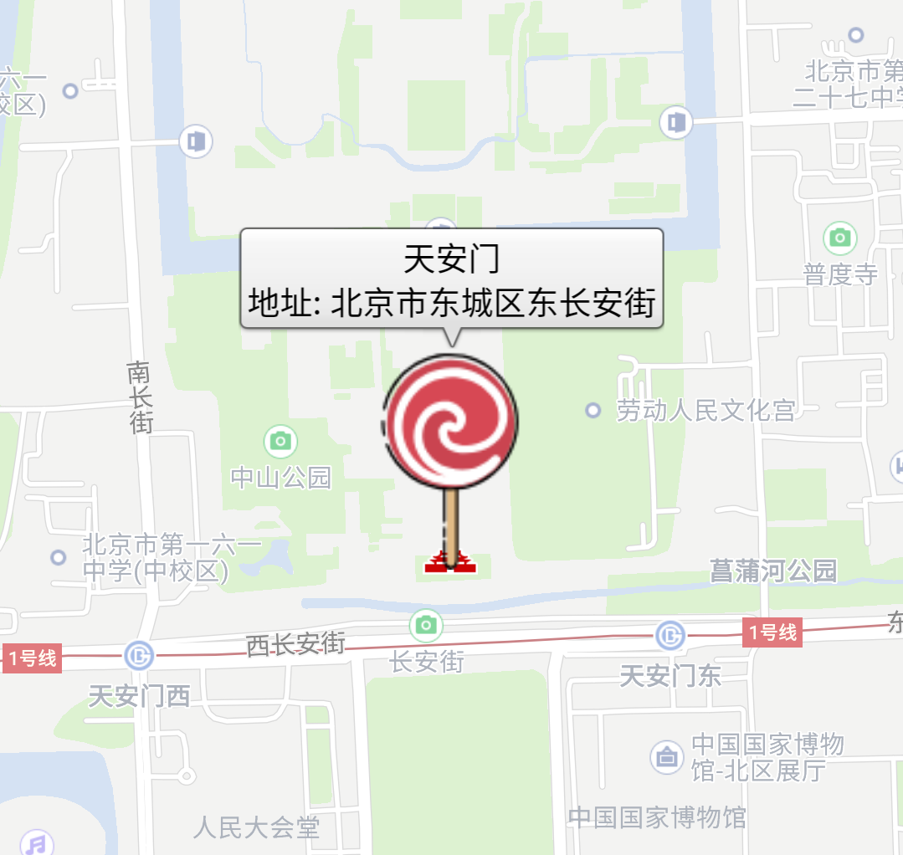
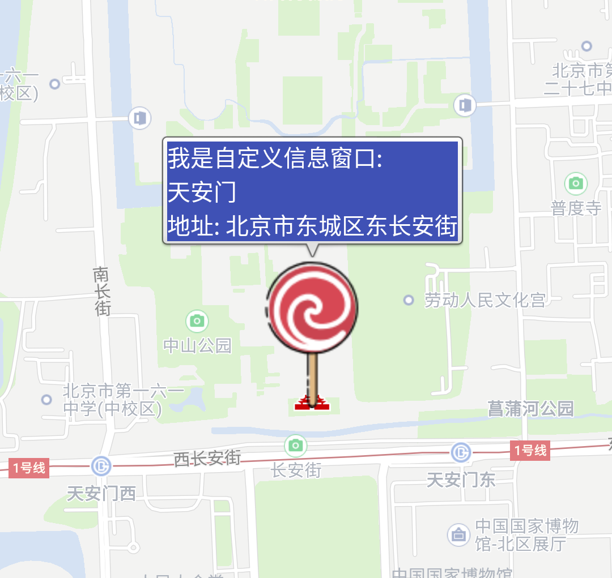
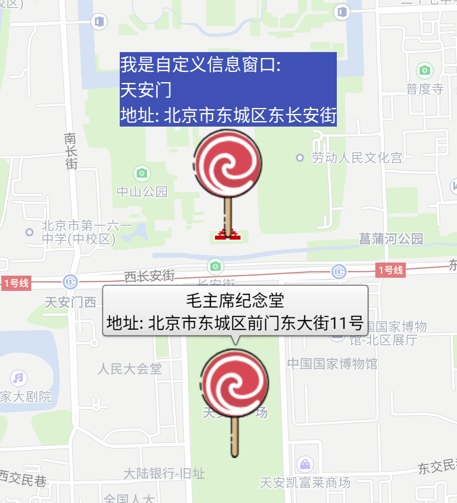

# 绘制信息窗口（InfoWindow）

### 简介

信息窗口，是依附于Marker之上的展现元素，用于对Marker进行详细描述，腾讯地图SDK默认提供的InfoWindow分标题和简述两部分，开发者也可以自定义InfoWindow，满足个性化场景的要求。

按照实现方式，可将InfoWindow分为两类：

1. Bitmap型，通过View布局转化成Bitmap，然后由渲染引擎绘制在地图上展示
2. View型，通过View布局直接在地图上展示

两者之间的对比表格

| 类型     | 定制化 | 动画 | 性能 | 复杂度 |
| -------- | ------ | ---- | ---- | ------ |
| Bitmap型 | 低     | 有限 | 高   | 低     |
| View型   | 高     | 支持 | 低   | 高     |

开发者需要针对不同场景选择适合的类型，展示信息窗口，下面我们来分五个部分介绍InfoWindow：

1. 默认信息窗口的显示和隐藏
2. 创建一个自定义信息窗口
3. 注册信息窗口的事件监听
4. 播放信息窗口的动画
5. 开启多窗口模式

### 默认信息窗口的显示和隐藏

开发者使用MarkerOptions或者Marker来开启InfoWindow和设置信息内容

当点击Marker的时候，将显示InfoWindow

```java
//通过MarkerOptions配置
LatLng position = new LatLng(39.908710,116.397499);
MarkerOptions options = new MarkerOptions(position);
options.infoWindowEnable(false);//默认为true
options.title("天安门")//标注的InfoWindow的标题
  		 .snippet("地址: 北京市东城区东长安街")//标注的InfoWindow的内容
  		 .icon(BitmapDescriptorFactory.fromResource(R.drawable.marker));//设置自定义Marker图标
mMarker = mTencentMap.addMarker(options);

//开启信息窗口
mMarker.setInfoWindowEnable(true);
```

通过接口显示和隐藏InfoWindow

```java
//显示信息窗口
mMakrer.showInfoWindow();
//隐藏信息窗口
mMakrer.hideInfoWindow();
```

信息窗口展现效果图：



### 创建一个自定义信息窗口

腾讯地图SDK在TencenMap接口中，TencentMap.InfoWindowAdapter类用来提供自定义窗口能力，该类提供两个接口：无边框自定义View和带边框自定义View。

当开发者配置了InfoWindowAdapter时，MarkerOptions中的title和snippet属性即失效。

```java
//配置InfoWindowAdapter
mTencentMap.setInfoWindowAdapter(new TencentMap.InfoWindowAdapter() {
  @Override
  public View getInfoWindow(final Marker marker) {
    //创建无边框自定义View
    return View.inflate(context,R.layout.custom_infowindow, null);
  }
  @Override
  public View getInfoContents(final Marker marker) {
    //创建带边框自定义View
    return View.inflate(context,R.layout.custom_infowindow, null);
  }
});
```



### 注册信息窗口的事件监听

当使用Bitmap类型时，InfoWindow可接受点击事件，当使用View类型时，则事件监听由View来接管处理

```java
//设置点击事件
mTencentMap.setOnInfoWindowClickListener(new TencentMap.OnInfoWindowClickListener() {
  @Override
  public void onInfoWindowClick(Marker marker) {
    Toast.makeText(getApplicationContext(), "信息窗被点击", Toast.LENGTH_SHORT).show();
  }

  @Override
  public void onInfoWindowClickLocation(int width, int height, int x, int y) {
    Toast.makeText(getApplicationContext(),
                   "尺寸：" + width + "x" + height + " 位置：" + X + "," + y,
                   Toast.LENGTH_SHORT).show();
  }
});
```

### 播放信息窗口的动画

当使用Bitmap类型时，InfoWindow的动画由引擎内部支持，仅支持有限的几种动画类型，比如：渐变、缩放、平移、旋转。

当使用View类型时，InfoWindow的动画由View系统支持，可由开发者自定义处理。


### 开启多窗口模式

默认情况下，多窗口模式是关闭的，不能在地图上显示多个信息窗口，通过TencentMap.enableMultipleInfowindow(boolean)接口来开启和关闭多窗口模式，开启多窗口模式之后，在多个Marker上点击，都能正常显示信息窗口。

```java
//开启多窗口模式
mTencentMap.enableMultipleInfowindow(true);
```



---

### 常见问题

1. InfoWindow是否支持Gif动态图

   > 支持。使用View型InfoWindow可支持自定义View，然后使用Drawable动画来实现Gif动效

2. InfoWindowAdapter接口使用View失败

   > 在实现该接口方法时候，应该在接口的实现内部提供一个无父级的View对象。另外，需要注意一个问题：`在接口实现中，不能调用Marker.showInfoWIndow，否则会导致方法循环调用。`