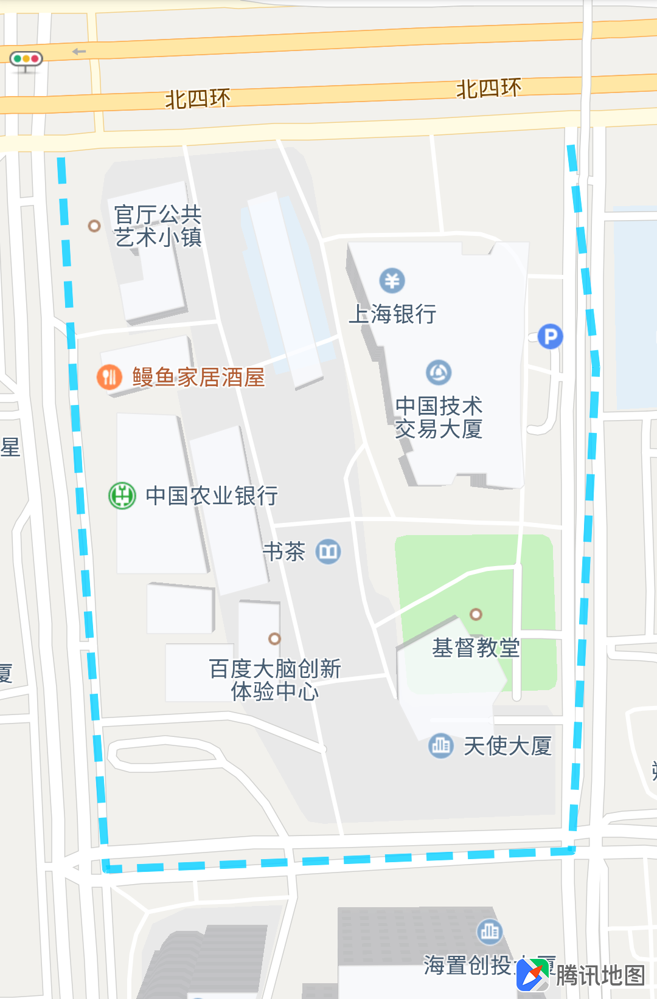
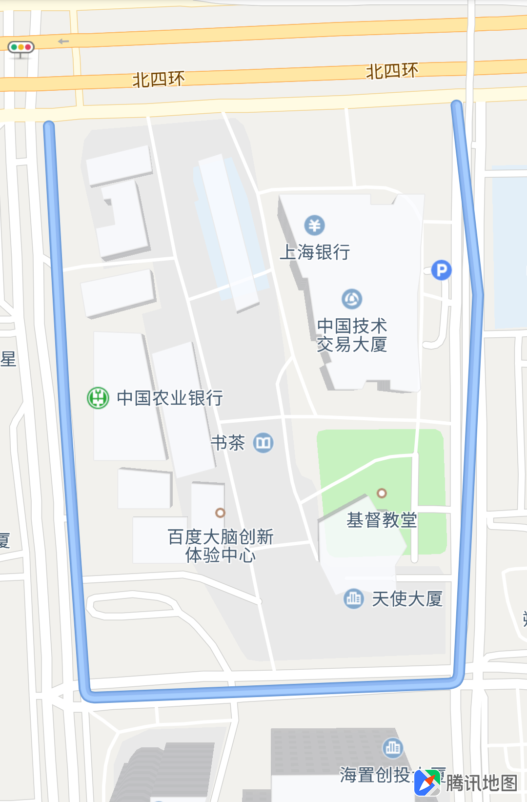
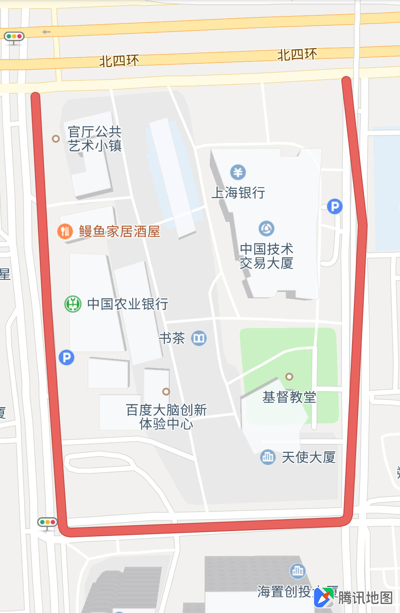
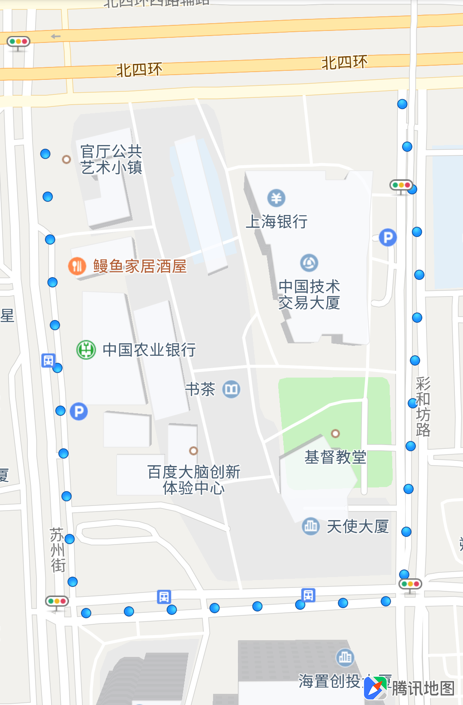
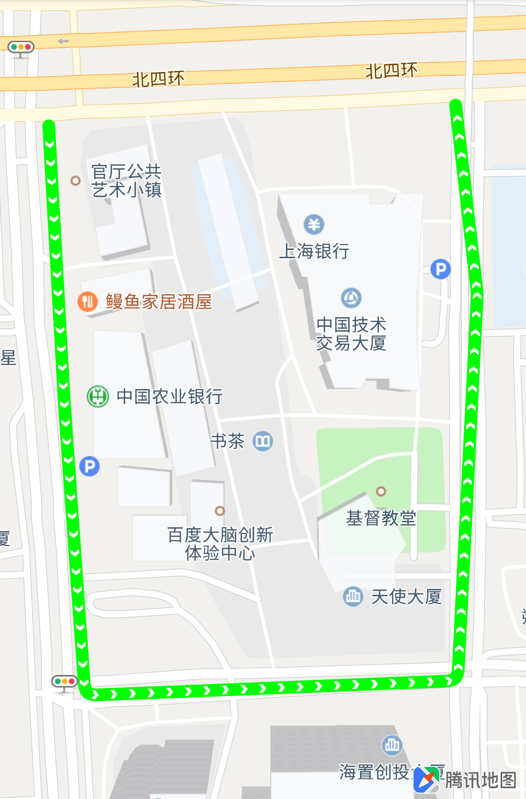
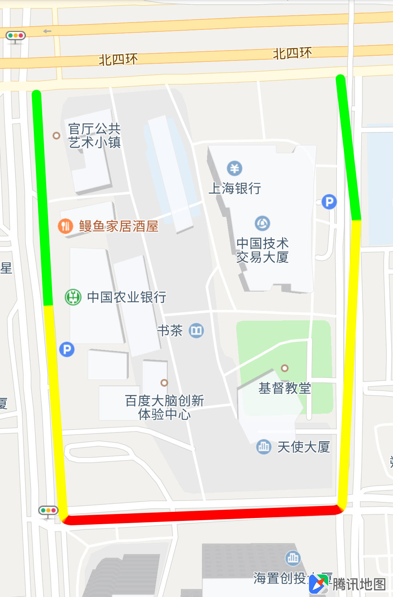
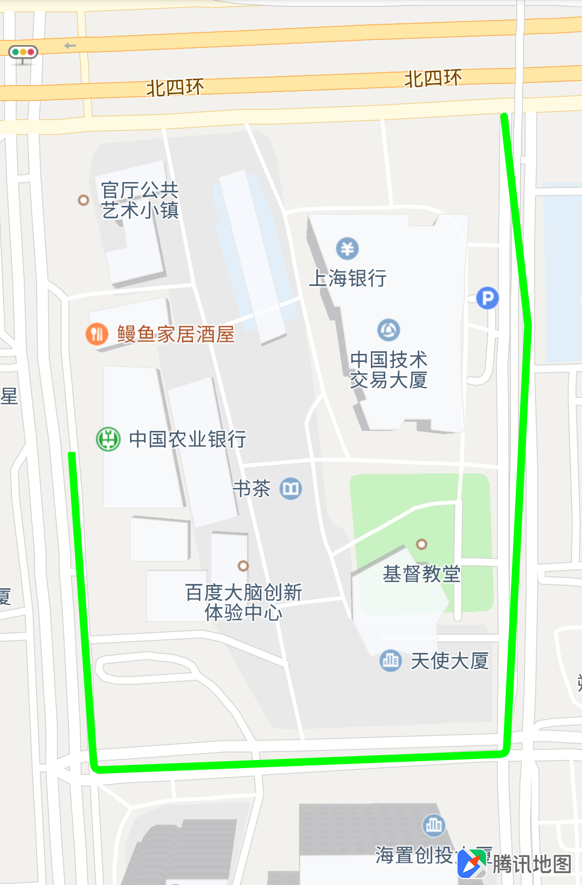
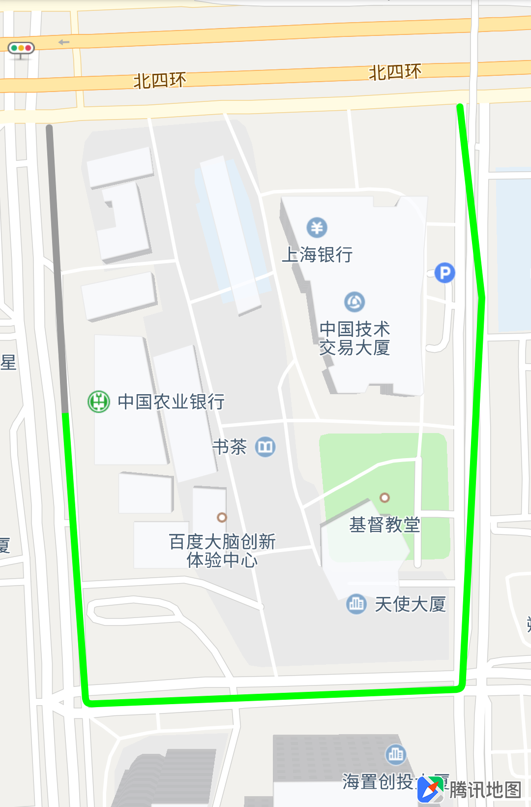
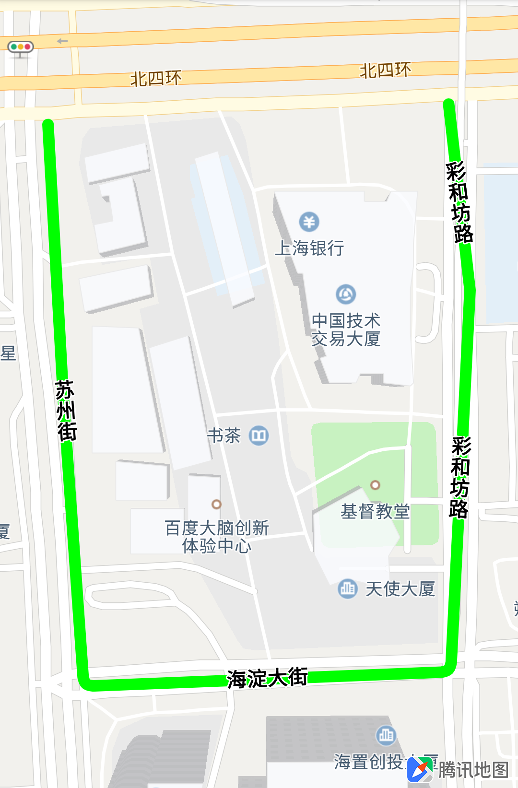

# 绘制线

### 简介

线是由一组经纬度点按照一定的顺序连接而成，在地图上绘制线由 Polyline 类定义实现。通常用来表示一段路、轨迹等线型场景。

### 添加线

添加折线的同时可以设置线的颜色、宽度等属性，示例代码如下：

```java
// 构造折线点串
List<LatLng> latLngs = new ArrayList<LatLng>();
latLngs.add(new LatLng(39.984864,116.305756));
latLngs.add(new LatLng(39.983618,116.305848));
latLngs.add(new LatLng(39.982347,116.305966));
latLngs.add(new LatLng(39.982412,116.308111));
latLngs.add(new LatLng(39.984122,116.308224));
latLngs.add(new LatLng(39.984955,116.308099));

// 构造 PolylineOpitons
PolylineOptions polylineOptions = new PolylineOptions()
        .addAll(latLngs)
        // 折线设置圆形线头
        .lineCap(true)
        // 折线的颜色为绿色
        .color(0xff00ff00)
        // 折线宽度为25像素
        .width(25)
        // 还可以添加描边颜色
        .borderColor(0xffff0000)
        // 描边颜色的宽度，线宽还是 25 像素，不过填充的部分宽度为 `width` - 2 * `borderWidth`
        .borderWidth(5);

// 绘制折线
Polyline polyline = tencentMap.addPolyline(polylineOptions);

// 将地图视野移动到折线所在区域(指定西南坐标和东北坐标)，设置四周填充的像素
tencentMap.moveCamera(CameraUpdateFactory.newLatLngBounds(
        new LatLngBounds.Builder()
                .include(getLatlons()).build(),
        100));
```

上面绘制的折线有四个顶点，折线颜色为绿色，折线宽度为15像素，效果如下图所示：


#### 绘制虚线

我们提供了两个将线设置为虚线的方式：
1. 初始化线实例时通过 PolylineOptions 对象的属性直接绘制虚线

    ```java
    // 构造 PolylineOpitons
    PolylineOptions polylineOptions = new PolylineOptions()
            .addAll(latLngs)
            // 折线宽度为15像素
            .width(15);

    // 设置虚线模式
    List<Integer> pattern = new ArrayList<>();
    pattern.add(35);
    pattern.add(20);
    polylineOptions.pattern(list);

    Polyline polyline = tencentMap.addPolyline(polylineOptions);
    ```

2. 将已获取到的 Polyline 实例修改为虚线

    ```java
    // 设置虚线
    List<Integer> pattern = new ArrayList<>();
    pattern.add(35);
    pattern.add(20);
    polyline.pattern(pattern);  
    ```

参数pattern的元素数量必须是偶数个，每对元素分别表示虚线中实线区域的长度，以及空白区域的长度（单位px\)。绘制的虚线效果如下图所示：



#### 带阴影效果的线

通常用户使用 ARGB 颜色值直接设置线的颜色，这能满足大部分场景，但对于希望有阴影效果的线就无法满足了。地图 SDK 支持用纹理填充线来实现阴影等效果，这个纹理可以理解为线的截面纹理，地图把这个截面的纹理沿线绘制的方向填充到整条线。地图 SDK 内置一份纹理填充颜色，用户只需要通过 `PolylineOptions.color(int i)` 接口设置 `PolylineOptions.Colors` 中定义的 [0, 10] 号对应的颜色就能展示对应的效果。

```java
// 构造 PolylineOpitons
PolylineOptions polylineOptions = new PolylineOptions()
        .addAll(latLngs)
        // 折线设置圆形线头
        .lineCap(true)
        // 纹理颜色
        .color(PolylineOptions.Colors.GRAYBLUE)
        .width(25);

// 绘制折线
Polyline polyline = tencentMap.addPolyline(polylineOptions);
```

效果如下图所示：



如果我们提供的纹理不能满足您的需求，您也可以使用自己设计的纹理应用到地图上。使用方法如下：

```java

PolylineOptions polylineOptions = new PolylineOptions()
        .addAll(latLngs)
        // 折线设置圆形线头
        .lineCap(true)
        //设置用户自己的纹理，此例中我们的纹理放在了工程的 assets 目录
        .colorTexture(BitmapDescriptorFactory
                .fromAsset("color_texture.png"))
        //使用我们纹理图片的第三行像素填充线的每个像素截面
        .color(2);

```


### 沿线展示纹理图片

地图 SDK 提供了两种方式将纹理图片沿线绘制出来。
1. 设置线路绘制类型为点，并设置自定义纹理的代码和效果如下：

    ```java
    // 设置线路绘制类型为点，自定义点的纹理
    Polyline polyline = tencentMap.addPolyline(
            new PolylineOptions()
                    .addAll(latLngs)
                    // 线路绘制类型
                    .lineType(PolylineOptions.LineType.LINE_TYPE_DOTTEDLINE)
                    // 设置图片作为线的填充纹理
                    .colorTexture(BitmapDescriptorFactory.
                            fromAsset("color_point_texture.png"))
                    .width(25);
    );
    ```

    

2. 线上叠加纹理，以线上绘制箭头为例
   
    ```java
    // 构造 PolylineOpitons
    PolylineOptions polylineOptions = new PolylineOptions()
            .addAll(latLngs)
            // 折线设置圆形线头
            .lineCap(true)
            // 折线的颜色为绿色
            .color(0xff00ff00)
            // 折线宽度为25像素
            .width(25)
            // 必须打开这个开关，允许在线上绘制纹理
            .arrow(true);
            // 支持设置纹理的间距
            .arrowSpacing(30);
            // 设置纹理图片
            .arrowTexture(
                    BitmapDescriptorFactory
                            .fromAsset("color_arrow_texture.png"));;

    // 绘制折线
    Polyline polyline = tencentMap.addPolyline(polylineOptions);
    ```
    
    

### 设置线的分段颜色

可以通过 PolylineOptions 对象的属性直接设置分段颜色，示例代码（也包含了其他属性的设置）如下：

```java
// 构造 PolylineOpitons
PolylineOptions polylineOptions = new PolylineOptions()
        .addAll(latLngs)
        // 折线设置圆形线头
        .lineCap(true)
        // 折线宽度为15像素
        .width(15);


// 绘制折线
Polyline polyline = tencentMap.addPolyline(polylineOptions);
// 设置分段，线的顶点索引
int[] indexes = {0,1,2,3,4,5};
// 设置每段索引之间的颜色，这个颜色同样支持纹理颜色，即 PolylineOptions.Colors 中定义的 [0, 10] 值
int[] colors = {0xff00ff00, 0xffffff00, 0xffff0000, 0xffffff00, 0xff00ff00};
// 将分段颜色设置给线1
polyline.setColors(color,index);
```



### 擦除

我们支持线从 Polyline 中索引为 0 的坐标点开始擦除到用户指定的坐标点。以上面的线为例,从第一段中擦除一部分：

```java
Polyline polyline = tencentMap.addPolyline(polylineOptions);
// 必须设置 `true`，默认为 `false`
polyline.setEraseable(true);
//其中第一个参数表示要擦除到的坐标索引 `index`
// 第二个参数表示从 [`index -1`, `index`] 之间的坐标
// 如果这个坐标不在擦除的索引范围内，会一直擦除到 `index`
polyline.eraseTo(1, new LatLng(39.983919,116.305722));
```



### 设置擦除颜色

也有的场景下用户不希望地图上的线被擦除，而是希望保留擦除前的痕迹，地图 SDK 提供了设置擦除线颜色的接口，调用示例如下：

```java
PolylineOptions polylineOptions = new PolylineOptions()
        .addAll(latLngs)
        // 折线设置圆形线头
        .lineCap(true)
        // 折线的颜色为绿色
        .color(0xff00ff00)
        // 折线宽度为25像素
        .width(25)
        // 设置擦除颜色为灰色
        .eraseColor(0xff999999);

Polyline polyline = tencentMap.addPolyline(polylineOptions);
// 必须设置 `false`，默认为 `true`
polyline.setEraseable(false);
//其中第一个参数表示要擦除到的坐标索引 `index`
// 第二个参数表示从 [`index -1`, `index`] 之间的坐标
// 如果这个坐标不在擦除的索引范围内，会一直擦除到 `index`
polyline.eraseTo(1, new LatLng(39.983919,116.305722));
```



### 添加文字标注

地图 SDK 支持在线上添加文字标注，文字可以作为线的属性和在线上绘制出来。主要支持以下功能：

| 接口名称 | 功能概述 |
| :-- | :-- |
| PolylineOptions.text(Text text) | 置沿 polyline 展示的文字 |
| PolylineOptions.Text.Builder(SegmentText segmentText | PolylineOptions.Text 构造器 |
| PolylineOptions.Text.Builder.addSegmentText(SegmentText segmentText) | 添加线上展示文字的点串范围 |
| PolylineOptions.Text.Builder.color(int color) | 设置文字颜色 |
| PolylineOptions.Text.Builder.strokeColor(int color) | 设置文字描边颜色 |
| PolylineOptions.Text.Builder.size(int size) | 设置文字尺寸 |
| PolylineOptions.Text.Builder.priority(TextPriority priority) | 设置文字优先级 |

下面为调用示例：


设置折线每条线段上要添加的文字

```java
public PolylineOptions.Text createText() {
List<PolylineOptions.SegmentText> segmentTexts = new ArrayList<>();
// SegmentText的三个参数分别为起点在数组中的下标，终点在数组中的下标，以及要显示的文字
segmentTexts.add(new PolylineOptions.SegmentText(0, 2, "苏州街"));
segmentTexts.add(new PolylineOptions.SegmentText(2, 3, "海淀大街"));
segmentTexts.add(new PolylineOptions.SegmentText(3, 5, "彩和坊路"));
return new PolylineOptions.Text.Builder(segmentTexts).build();
}
```
将文字添加到线上

```java
PolylineOptions polylineOptions = new PolylineOptions()
        .addAll(latLngs)
        // 折线设置圆形线头
        .lineCap(true)
        // 折线的颜色为绿色
        .color(0xff00ff00)
        // 折线宽度为25像素
        .width(25)
        // 设置文字
        .text(createText());

Polyline polyline = tencentMap.addPolyline(polylineOptions);
```



### 添加折线动画

可以为折线添加动画，腾讯地图SDK目前支持两种动画类型，AlphaAnimation和EmergeAnimation。AlphaAnimation 支持从一个Alpha（透明度）到另一个Alpha的渐变，取值范围为\[0.0 ~ 1.0\]；

EmergeAnimation 从一点开始然后向两端扩展，当然也可以设置为起点或是终点，如果设置的点不在线上，则从线与这个点最近的那个点开始。

```java
Button button = (Button)findViewById(R.id.start_alpha_animation) ;
button.setOnClickListener(new View.OnClickListener() {
        @Override
        public void onClick(View view) {
            // 添加折线动画
            AlphaAnimation alphaAnimation = new AlphaAnimation(0.1f, 1);
            alphaAnimation.setDuration(1500);
            alphaAnimation.setInterpolator(new AccelerateDecelerateInterpolator());
            alphaAnimation.setAnimationListener(new AnimationListener() {
                @Override
                public void onAnimationStart() {

                }

                @Override
                public void onAnimationEnd() {
                    // AlphaAnimation动画结束后，显示EmergeAnimation动画
                    EmergeAnimation emergeAnimation = new EmergeAnimation(polyline.getPoints()
                            .get(polyline.getPoints().size()/2));
                    emergeAnimation.setDuration(2500);
                    emergeAnimation.setInterpolator(new DecelerateInterpolator());
                    polyline.startAnimation(emergeAnimation);
                }
            });
            if (polyline != null){
                // AlphaAnimation动画
                polyline.startAnimation(alphaAnimation);
            }
        }
    }
);
```

#### 移除折线
----

从地图移除折线：

```java
polyline.remove();
```