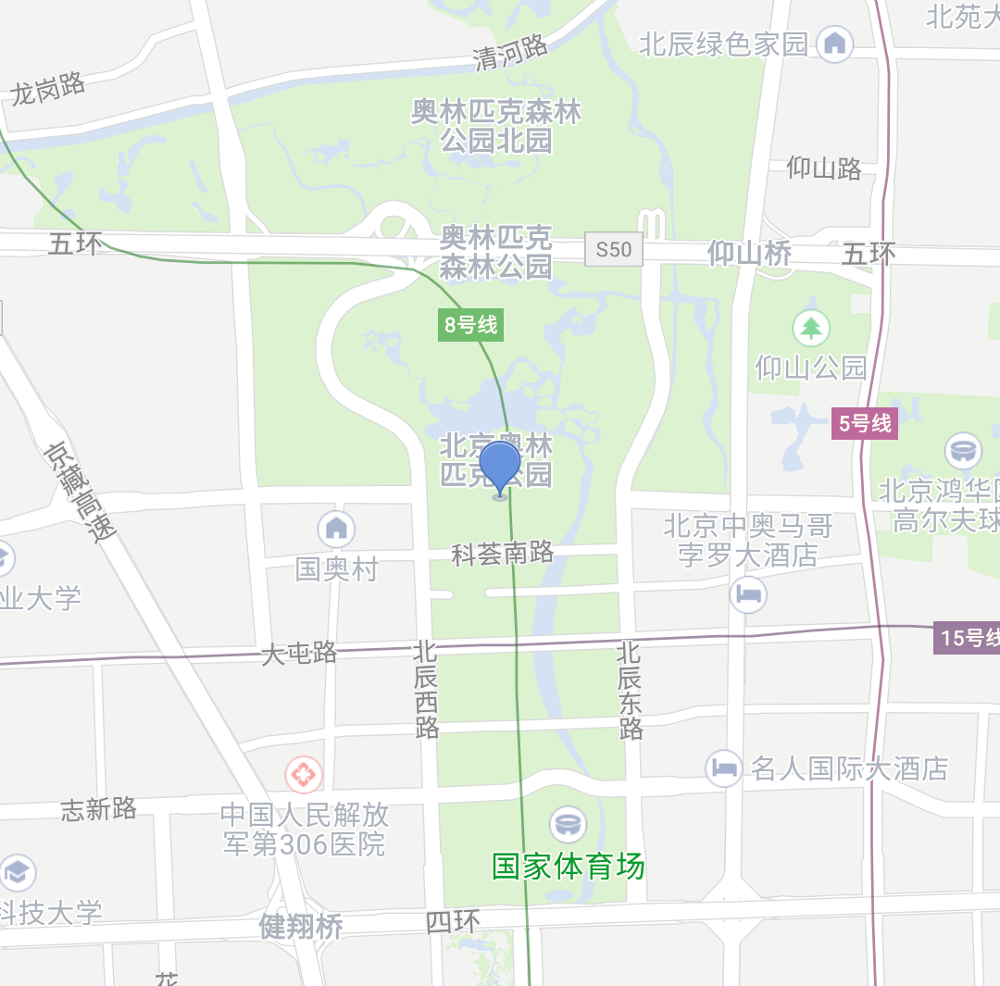
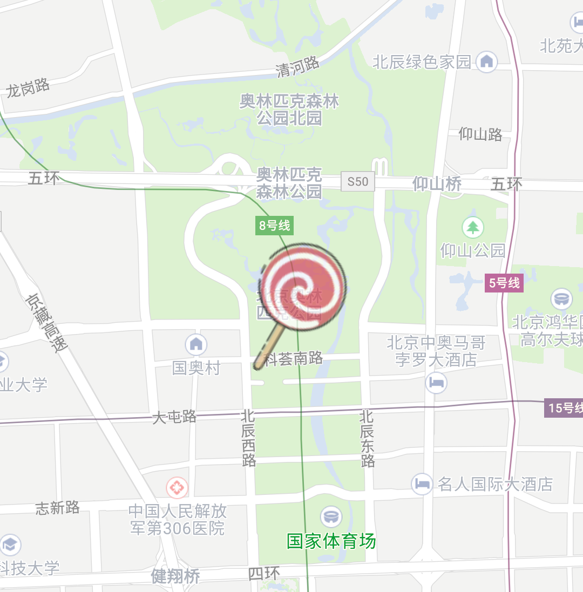

# 绘制点标记（Marker）

### 简介

点标记，是在地图上用来标记一个经纬度坐标的覆盖物，包括点图标和浮在点之上的信息窗（常称之为InfoWindow）。腾讯地图SDK为点标记提供了丰富的样式和场景使用，此篇着重介绍点标记图标相关内容，信息窗单独在[另一篇文章](./infoWindow.html)中介绍，那么接下来我们将分五部分来详细介绍点标记：

1. 常用属性解释
2. 添加一个默认Marker
3. 自定义Marker属性
4. Marker的事件操作
5. 移除Marker

### 常用属性解释

MarkerOptions对象

| 属性                  | 接口                                             | 说明                                                         |
| --------------------- | ------------------------------------------------ | ------------------------------------------------------------ |
| position              | position(LatLng):MarkerOptions                   | 指定经纬度坐标，必填参数                                     |
| icon                  | icon(BitmapDescriptor):MarkerOptions             | 设置点图标样式，默认为系统图标，使用BitmapDescriptorFactory创建自定义的icon |
| anchor                | anchor(float,float):MarkerOptions                | 设置锚点，默认为(0.5,0.5)为图标中心，该属性影响Marker的位置、旋转、变形动画等操作 |
| alpha                 | alpha(float):MarkerOptions                       | 设置透明度，默认1不透明                                      |
| flat                  | flat(boolean):MarkerOptions                      | 设置是否支持3D悬浮，默认false                                |
| rotation              | rotation(float):MarkerOptions                    | 设置旋转角度，默认为0，旋转中心点以锚点为中心                |
| clockwise             | clockwise(boolean):MarkerOptions                 | 设置旋转方向是否顺时针，默认true为顺时针                     |
| level                 | level(int):MarkerOptions                         | 设置图层级别，默认OverlayLevel.OverlayLevelAboveLabels显示在所有POI之上，还可以设置为OverlayLevelAboveBuildings、OverlayLevelAboveRoads，分别是在楼块之上POI之下、在道路之上楼块之下 |
| zIndex                | zIndex(int):MarkerOptions                        | 设置显示顺序，在相同level情况下，值越大显示越靠近顶部        |
| visible               | visible(boolean):MarkerOptions                   | 设置可见性，默认可见                                         |
| draggable             | draggable(boolean):MarkerOptions                 | 设置是否支持拖拽，默认false                                  |
| fastload              | fastLoad(boolean):MarkerOptions                  | 设置允许快速加载模式，默认true，影响icon的更新性能，建议在频繁更新icon的情况关闭此模式 |
| infoWindow<br/>Enable | infoWindowEnable<br/>(boolean):MarkerOptions     | 设置是否开启InfoWindow，默认true为开启                       |
| infoWindow<br/>Anchor | infoWindowAnchor<br/>(float,float):MarkerOptions | 设置InfoWindow的锚点，默认为(0.5,1)为底边中心点              |
| infoWindow<br/>Offset | infoWindowOffset<br/>(int,int):MarkerOptions     | 设置InfoWindow的偏移量                                       |
| viewInfoWindow        | viewInfoWindow<br />(boolean):MarkerOptions      | 设置InfoWindow类型为View，默认为false                        |
| title                 | title(String):MarkerOptions                      | 设置默认InfoWindow的标题                                     |
| snippet               | snippet(String):MarkerOptions                    | 设置默认InfoWindow的描述                                     |
| indoorInfo            | indoorInfo(IndoorInfo):MarkerOptions             | 关联室内建筑，将Marker显示在室内楼层内                       |

Marker对象

| 属性              | 相关接口                                                  | 说明                                       |
| ----------------- | --------------------------------------------------------- | ------------------------------------------ |
| animation         | setAnimation(Animation):void<br/>startAnimation():boolean | 设置动画<br />开始动画                     |
| fixingPoint       | setFixingPointEnable(boolean):void                        | 设置当前Marker固定在屏幕上，不跟随地图拖动 |
| clickable         | setClickable(boolean):void                                | 设置是否可被点击                           |
| tag               | setTag(Object):void                                       | 设置标签                                   |
| remove            | remove():void                                             | 移除Marker                                 |
| showInfoWindow    | showInfoWindow():void                                     | 显示信息窗口                               |
| refreshInfoWindow | refreshInfoWindow():void                                  | 刷新信息窗口                               |
| hideInfoWindow    | hideInfoWindow():void                                     | 隐藏信息窗口                               |
| isInfoWindowShown | isInfoWindowShown():boolean                               | 信息窗口是否正在显示                       |

### 添加一个默认Marker

腾讯地图SDK提供很多默认的Marker样式，通过TencentMap添加Marker接口，即可添一个默认样式的Marker

```java
LatLng position = new LatLng(40.011313,116.391907);
Marker marker = mTencentMap.addMarker(new MarkerOptions(position));
```

效果如下图：



### 自定义Marker属性

开发者如果想自定义Marker的样式属性，可以通过两个阶段进行修改：

1. 创建Marker对象之前，可以通过修改MarkerOptions选项来初始化Marker 
2. 创建Marker对象之后，可以通过Marker对象，来修改属性

```java
//创建Marker对象之前，设置属性
LatLng position = new LatLng(40.011313,116.391907);
BitmapDescriptor custom = BitmapDescriptorFactory.fromResource(R.drawable.marker);
mCustomMarker = mTencentMap.addMarker(new MarkerOptions(position)
                                      .icon(custom)
                                      .alpha(0.7f)
                                      .flat(true)
                                      .clockwise(false)
                                      .rotation(30));
```

```java
//创建Marker对象之后，修改属性
Animation animation = new AlphaAnimation(0.7f, 0f);
animation.setDuration(2000);
mCustomMarker.setAnimation(animation);
mCustomMarker.startAnimation();
```

效果如下图：



###  Marker的事件操作

在Marker上，目前支持点击、拖拽两种事件：

##### 点击事件

```java
mTencentMap.setOnMarkerClickListener(new TencentMap.OnMarkerClickListener(){
    @Override
    public boolean onMarkerClick(Marker marker) {
      	if(marker.getId().equals(mCustomMarker.getId())) {
          //自定义Marker被点击
        }
    }
});
//设置Marker支持点击
mMarker.setClickable(true);
```

##### 拖拽事件

```java
mTencentMap.setOnMarkerDragListener(new TencentMap.OnMarkerDragListener(){
    @Override
    public void onMarkerDragStart(Marker marker) {
      //当前手指按住Marker拖拽开始
    }
    @Override
    public void onMarkerDrag(Marker marker) {
      //当前手指按住Marker拖拽中
    }
    @Override
    public void onMarkerDragEnd(Marker marker) {
      //当前手指按住Marker拖拽结束
    }
});
//设置Marker支持拖拽
mMarker.setDraggable(true);
```

### 移除Marker

```java
//从地图中移除Marker
mMarker.remove();
```

-----

### 常见问题

1. 如何添加海量的Marker

   > Marker是绘制在地图之上的图片资源，当使用海量的Marker数据时，为了性能体验，建议使用[点聚合](https://lbs.qq.com/android_v1/guide-3d.html#link-twelve)[^1.0.5]来辅助显示
   
2. 如何添加Marker动画

   > Marker支持Animation动画，目前支持平移、缩放、旋转、渐变四种

[^1.0.5]: com.tencent.map:sdk-utilities:1.0.5

