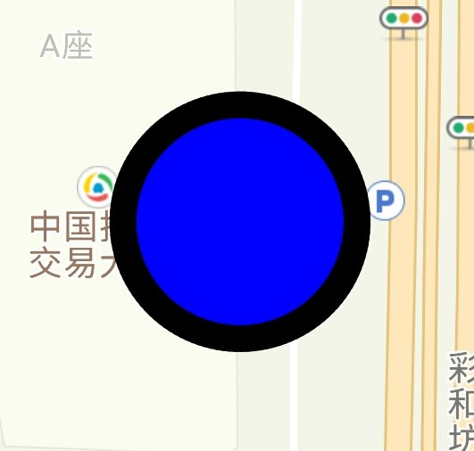

# 绘制面和形状

### 简介

地图上的面一组在地图上的封闭线段组成的图形，包括圆形和多边形，用户可以为它设置描边和填充颜色。

### 多边形

多边形是由 Polygon 类定义的一组在地图上的封闭线段组成的图形，它由一组 LatLng 点按顺序连接而成。添加折线使用 `Tencentmap.addPolygon(PolygonOptions options)` 接口返回 Polygon 实例，Polygon 是在地图上画多边形的类，可以移除`remove()`多边形、设置多边形顶点、描边的宽度和颜色、多边形的填充色、层级关系、可见性、可点击性，也可以通过`setOptions(PolygonOptions opts)`设置一组属性。

下面的代码展示了添加多边形、设置多边形属性、移除多边形的方法：

```java
//添加多边形
LatLng[] latLngs = {
        new LatLng(39.873911,116.379548),
        new LatLng(39.985538,116.448212),
        new LatLng(39.946595,116.387788),
        new LatLng(39.980277,116.305390)};
Polygon polygon = tencentMap.addPolygon(new PolygonOptions().
        //连接封闭图形的点
        add(latLngs).
        //填充颜色为红色
        fillColor(0xffff0000).
        //边线颜色为黑色
        strokeColor(0xff000000).
        //边线宽度15像素
        strokeWidth(15));

// 将地图视野移动到多边形所在区域，指定了经纬度和缩放级别
tencentMap.moveCamera(CameraUpdateFactory
                .newLatLngZoom(new LatLng(39.873911, 116.379548), 10));

// 设置多边形描边的宽度
polygon.setStrokeWidth(5);

// 移除多边形
polygon.remove();
```

绘制的多边形效果如下图所示：


### 圆形

圆形是由 Circle 类定义的封闭曲线，在腾讯地图构造一个圆形需要确定它的圆心和半径。

圆的实例化需要一个 CircleOptions 对象，该对象是创建圆的参数类，可以设置圆心坐标、半径、描边的宽度和颜色、圆的填充颜色、层级、可见性、可点击性等属性。

添加圆返回的是一个 Circle 对象，该队形是在地图上画圆的类，可以通过它修改圆的属性。

添加圆、修改属性、移除圆的具体示例代码如下：

```java
//添加圆
LatLng latLng = new LatLng(39.984059,116.307771);
circle = tencentMap.addCircle(new CircleOptions().
    // 圆心
    center(latLng).
    // 半径
    radius(1000d).
    // 圆的填充色为蓝色
    fillColor(0xff0000ff).
    // 描边的颜色为黑色
    strokeColor(0xff000000).
    // 描边宽度
    strokeWidth(15).
    // 可点击性
    clickable(false).
    // 可见性
    visible(true).
    // 层级
    zIndex(2));

// 将地图视野移动到多边形所在区域，指定了经纬度和缩放级别
tencentMap.moveCamera(CameraUpdateFactory
                .newLatLngZoom(new LatLng(39.984059,116.307771), 10));

// 设置圆的填充色为红色
circle.setFillColor(0xFFFF0000);

// 移除圆
circle.remove();
```

绘制的圆效果如下图所示：

