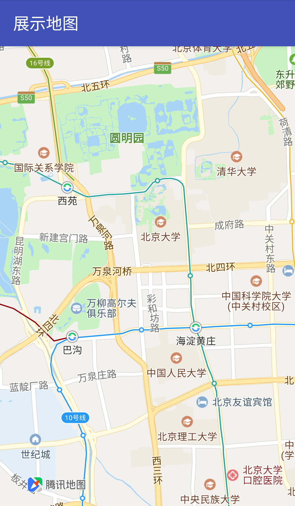

# 控件位置调整

### 简介

腾讯地图 SDK 的 logo、比例尺和指南针控件允许开发者调整它们在 MapView 中的位置，以满足开发者自己应用的设计需求。

### logo

开发者在修改 logo 位置时，应满足[腾讯地图开放API服务协议](https://lbs.qq.com/terms.html)提出的要求，不允许对 logo 进行遮挡等弱化地图品牌行为。logo 的位置调整接口由 `UiSettings` 类提供，我们推荐使用下面两个接口设置地图商标的位置：

1. setLogoPosition(int logoAnchor) 

   `logoAnchor` 设置地图商标位置
   - TencentMapOptions.LOGO_POSITION_BOTTOM_CENTER 底边中心
   - TencentMapOptions.LOGO_POSITION_BOTTOM_LEFT 左下角
   - TencentMapOptions.LOGO_POSITION_BOTTOM_RIGHT 右下角
   - TencentMapOptions.LOGO_POSITION_TOP_CENTER 顶部中心
   - TencentMapOptions.LOGO_POSITION_TOP_LEFT 左上角
   - TencentMapOptions.LOGO_POSITION_TOP_RIGHT 右上角

2. setLogoPosition(int logoAnchor, int[] marginParams)

   这个接口中 `logoAnchor` 只支持将地图商标放到 MapView 的四个角落，但提供了设置商标与 MapView 边缘的间距的能力，比上一个接口功能更强大。

   `logoAnchor` 设置地图商标位置
   - TencentMapOptions.LOGO_POSITION_BOTTOM_LEFT 左下角
   - TencentMapOptions.LOGO_POSITION_BOTTOM_RIGHT 右下角
   - TencentMapOptions.LOGO_POSITION_TOP_LEFT 左上角
   - TencentMapOptions.LOGO_POSITION_TOP_RIGHT 右上角

   `marginParams` 是一个长度为 2 的数组，表示商标与 MapView 边缘的间距
    - 若 `logoAnchor` 为 LOGO_POSITION_BOTTOM_LEFT, 则 Logo 的 bottomMargin 为 marginParams[0], leftMargin 为 marginParams[1]
    - 若 `logoAnchor` 为 LOGO_POSITION_BOTTOM_RIGHT, 则 Logo 的 bottomMargin 为 marginParams[0], rightMargin 为 marginParams[1]
    - 若 `logoAnchor` 为 LOGO_POSITION_TOP_RIGHT, 则 Logo 的 topMargin 为 marginParams[0], rightMargin 为 marginParams[1]
    - 若 `logoAnchor` 为 LOGO_POSITION_TOP_LEFT，则 Logo 的 topMargin 为 marginParams[0], leftMargin 为 marginParams[1]

__使用示例__

```java
tencentMap.getUiSettings().setLogoPosition(
        //logo 放到左下角
        TencentMapOptions.LOGO_POSITION_BOTTOM_LEFT,
        //logo 距离 mapView 底边 50 像素，左边 100 像素
        new int[]{50, 100});
```

默认在右下角的商标就被调整到了左下角，且指定了距离 MapView 边缘的像素值：


### 比例尺

我们在 `UiSettings` 类中提供了两个方法设置比例尺在 MapView 中的位置：

1. setScaleViewPosition(int position)

   `position` 设置比例尺位置
       - TencentMapOptions.SCALEVIEW_POSITION_BOTTOM_CENTER 底边中心
       - TencentMapOptions.SCALEVIEW_POSITION_BOTTOM_LEFT 左下角
       - TencentMapOptions.SCALEVIEW_POSITION_BOTTOM_RIGHT 右下角
       - TencentMapOptions.SCALEVIEW_POSITION_TOP_CENTER 顶部中心
       - TencentMapOptions.SCALEVIEW_POSITION_TOP_LEFT 左上角
       - TencentMapOptions.SCALEVIEW_POSITION_TOP_RIGHT 右上角

2. setScaleViewPositionWithMargin(int position, int top, int bottom, int left, int right)
   
   `position` 设置比例尺位置
       - TencentMapOptions.SCALEVIEW_POSITION_BOTTOM_LEFT 左下角
       - TencentMapOptions.SCALEVIEW_POSITION_BOTTOM_RIGHT 右下角
       - TencentMapOptions.SCALEVIEW_POSITION_TOP_LEFT 左上角
       - TencentMapOptions.SCALEVIEW_POSITION_TOP_RIGHT 右上角

    `top` position 为 `TencentMapOptions.SCALEVIEW_POSITION_TOP_LEFT` 或 `TencentMapOptions.SCALEVIEW_POSITION_TOP_RIGHT` 时，该值生效，不需要偏移请传负数

    `bottom` position 为 `TencentMapOptions.SCALEVIEW_POSITION_BOTTOM_LEFT` 或 `TencentMapOptions.SCALEVIEW_POSITION_BOTTOM_RIGHT` 时，该值生效，不需要偏移请传负数

    `left` position 为 `TencentMapOptions.SCALEVIEW_POSITION_BOTTOM_LEFT` 或 `TencentMapOptions.SCALEVIEW_POSITION_TOP_LEFT` 时，该值生效，不需要偏移请传负数

    `right` position 为 `TencentMapOptions.SCALEVIEW_POSITION_BOTTOM_RIGHT` 或 `TencentMapOptions.SCALEVIEW_POSITION_TOP_RIGHT` 时，该值生效，不需要偏移请传负数

### 指南针

我们在 `UiSettings` 类中提供了设置指南针在 MapView 中的位置的方法：

1. setCompassExtraPadding(int padding)
   
   `padding` 设置指南针上边缘距离 MapView 上边缘的距离，单位：像素

2. setCompassExtraPadding(int xPadding, int yPadding)

   设置指南针距离 MapView 左边缘和上边缘的距离

   `xPadding` 指南针左边缘距离 MapView 左边缘的值，单位：像素
   `yPadding` 指南针上边缘距离 MapView 上边缘的值，单位：像素